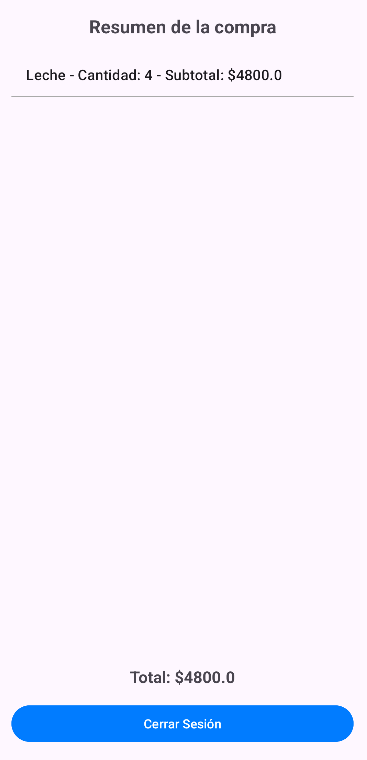
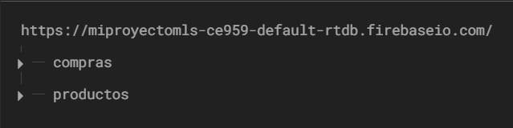

# Evaluación Final Unidad III
# Descripción
Este proyecto es una aplicación Android de un carrito de compra. Dicha aplicación lleva por nombre "PickEasy". Su función es la compra y venta de productos de supermercado.

# Funciones
El Login tiene dos opciones, "Cliente" y "Administrador". Esto lo implementé con SQLite. Al momento de ingresar a la aplicación, el usuario tiene que seleccionar uno de las dos opciones, pero si ingresa credenciales que son de cliente en administrador o viceversa no admite iniciar sesión, tiene que poner las credenciales correctas.
Las tablas productos y compras las hice con Firebase, específicamente con Realtime Database, por ende las compras que hace el cliente y los productos que ingresa el administrador se guardan aquí.

# Explicación "Cliente"
Al iniciar sesión con cliente aparece una ventana con todos los productos que existen. El usuario tiene que seleccionar un producto, poner la cantidad que quiere y después agregarlo, tiene que repetir ese paso hasta que termine de comprar, una vez lista la compra tiene que confirmar con el botón "Confirmar Compra". Una vez que pincha ese botón, sale un resumen y el total de la compra, además de un botón para cerrar la sesión.

# Explicación "Administrador"
Al iniciar sesión con administrador aparece una ventana donde se puede hacer un CRUD, además de una lista con los productos que hay en la base de datos. El administrador tiene que poner todos los campos, incluyendo el ID del producto y luego puede agregarlo. Por último puede hacer cualquier paso del CRUD.

# Evidencia con imágenes
Cuando se inicia el proyecto sale esta ventana. Aquí es donde se selecciona si es Cliente o Administrador: 

- Interfaz Inicio de Sesion:
  

  

# Interfaz Cliente
  
Interfaz Cliente 

  
- Se tiene que seleccionar un producto y luego tiene que ingresar la cantidad de ese producto
  
Interfaz Cliente 

  

- Interfaz Detalles Compra:
  

  

- Interfaz Administrador:
  

  

- Tablas en Firebase:

  

  

